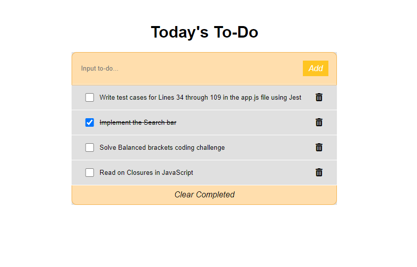

<a name="readme-top"></a>


<div align="center">

</div>


# 📗 Table of Contents

- [📖 About the Project](#about-project)
  - [🛠 Built With](#built-with)
    - [Tech Stack](#tech-stack)
    - [Key Features](#key-features)
  - [🚀 Live Demo](#live-demo)
- [💻 Getting Started](#getting-started)
  - [Setup](#setup)
  - [Prerequisites](#prerequisites)
  - [Install](#install)
  - [Usage](#usage)
  - [Run tests](#run-tests)
  - [Deployment](#triangular_flag_on_post-deployment)
- [👥 Authors](#authors)
- [🔭 Future Features](#future-features)
- [🤝 Contributing](#contributing)
- [⭐️ Show your support](#support)
- [🙏 Acknowledgements](#acknowledgements)
- [❓ FAQ (OPTIONAL)](#faq)
- [📝 License](#license)

<!-- PROJECT DESCRIPTION -->

# 📖 To Do List <a name="about-project"></a>


</div>

**To Do List** is a simple project developed by javascript and webpack, showing the simple list of tasks or exc to do with dynamic values.

## 🛠 Built With <a name="built-with"></a>

### Tech Stack <a name="tech-stack"></a>


<details>
  <summary>Client</summary>
  <ul>
  <li><a href="https:///">HTML & CSS</a></li>
  <li><a href="https:///">Javascript</a></li>
  <li><a href="https:///">ES6</a></li>
  <li><a href="https:///">Webpack</a></li>
  <li>
  </ul>
</details>

<details>
  <summary>Server</summary>
  <ul>
  </ul>
</details>

<details>
<summary>Database</summary>
  <ul>
  </ul>
</details>

<!-- Features -->

### Key Features <a name="key-features"></a>


- **Webpack Implementation**
- **Css Loaders**
- **Real world need project**

<p align="right">(<a href="#readme-top">back to top</a>)</p>

<!-- LIVE DEMO -->

## 🚀 Live Demo <a name="live-demo"></a>
- [Live Demo Link](https://danielochuba.github.io/TO-DO-LIST-M_R/dist/index.html)

<p align="right">(<a href="#readme-top">back to top</a>)</p>

<!-- GETTING STARTED -->

## 💻 Getting Started <a name="getting-started"></a>


To get a local copy up and running, follow these steps.

### Prerequisites

In order to run this project you need to :
1- install node.js and npm

<!--
Example command:

```sh
 gem install rails
```
 -->

### Setup

Clone this repository to your desired folder:


```sh
  cd my-folder
  git clone git@github.com:danielochuba/TO-DO-LIST-M_R.git
  cd To-Do-List
  npm install webpack webpack-cli --save-dev
  npm install --save lodash
  npm install --save-dev html-webpack-plugin
  npm install file-loader
```


### Install

Install this project with:

<!--
Example command:

```sh
  cd my-project
  gem install
```
--->

### Usage

To run the project, execute the following command:


```sh
  npm run build
  npm start
```


### Run tests

No Tests Necessary.


### Deployment


<!--
Example:

```sh

```
 -->

<p align="right">(<a href="#readme-top">back to top</a>)</p>

## 🚀 Live Demo <a name="live-demo"></a>


> - [TO-DO LIST APP](https://danielochuba.github.io/TO-DO-LIST-M_R/)

<!-- AUTHORS -->

## 👥 Authors <a name="authors"></a>

👤 **Daniel Ochuba**

- GitHub: [@danielochuba](https://github.com/danielochuba)
- Twitter: [@ochuba_daniel](https://twitter.com/ochuba_daniel)
- LinkedIn: [@daniel_ochuba](www.linkedin.com/in/daniel-ochuba-614572238)


<p align="right">(<a href="#readme-top">back to top</a>)</p>

<!-- FUTURE FEATURES -->

## 🔭 Future Features <a name="future-features"></a>


- [ ] **Use Local Storage for recording**
- [ ] **Apply a better user friendly interface**

<p align="right">(<a href="#readme-top">back to top</a>)</p>

<!-- CONTRIBUTING -->

## 🤝 Contributing <a name="contributing"></a>

Contributions, issues, and feature requests are welcome!

Feel free to check the [issues page](https://github.com/danielochuba/TO-DO-LIST-M_R/issues).

<p align="right">(<a href="#readme-top">back to top</a>)</p>

<!-- SUPPORT -->

## ⭐️ Show your support <a name="support"></a>


If you like this project please give me a comment.

<p align="right">(<a href="#readme-top">back to top</a>)</p>

<!-- ACKNOWLEDGEMENTS -->

## 🙏 Acknowledgments <a name="acknowledgements"></a>


I would like to thank Microverse for inspiring students doing such great things.

<p align="right">(<a href="#readme-top">back to top</a>)</p>

<!-- FAQ (optional) -->

## ❓ FAQ (OPTIONAL) <a name="faq"></a>


- **How did you use to record the data dynamically**

  - I am recording data in local storage and retrieving it.


<p align="right">(<a href="#readme-top">back to top</a>)</p>

<!-- LICENSE -->

## 📝 License <a name="license"></a>

This project is [MIT](./MIT.md) licensed.

_
<p align="right">(<a href="#readme-top">back to top</a>)</p>
